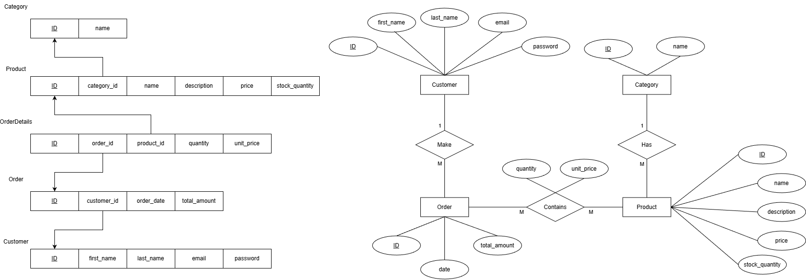

# E-commerce

## Introduction

This document provides a design for a simple e-commerce database system. 
It includes the database schema, entity relationships, example SQL queries for reporting, and de-normalization strategies.

---

## 1. Database ERD and Schema



---

## 2. Database Creation Script

### 2.1 Create Database
```sql
CREATE database IF NOT EXISTS e_commerce;
use e_commerce;
```

### 2.2 Create Customer Table
```sql
Create Table customer(
    id int auto_increment,
    first_name varchar(50) NOT NULL,
    last_name varchar(50) NOT NULL,
    email varchar(100) NOT NULL UNIQUE,
    password varchar(255) NOT NULL,
    PRIMARY KEY (id)
);
```

### 2.3 Create Orders Table
```sql
Create Table orders(
    id int auto_increment,
    customer_id int NOT NULL,
    order_date DATETIME NOT NULL,
    total_amount DECIMAL(10, 2) NOT NULL,
    PRIMARY KEY (id),
    CONSTRAINT fk_order_customer FOREIGN KEY (customer_id) REFERENCES customer(id)
);
```

### 2.4 Create Category Table
```sql
Create Table category (
    id int auto_increment,
    name varchar(50) NOT NULL UNIQUE,
    PRIMARY KEY (id)
);
```

### 2.5 Create Product Table
```sql
Create Table product (
    id int auto_increment,
    category_id int NOT NULL,
    name varchar(50) NOT NULL,
    description varchar (200),
    price DECIMAL(10, 2) NOT NULL,
    stock_quantity int NOT NULL,
    PRIMARY KEY (id),
    CONSTRAINT fk_product_category FOREIGN KEY (category_id) REFERENCES category(id) 
);
```

### 2.6 Create Order Details Table
```sql
Create Table order_details (
    id int auto_increment,
    order_id int NOT NULL,
    product_id int NOT NULL,
    quantity int NOT NULL CHECK(quantity > 0),
    unit_price DECIMAL(10, 2) NOT NULL,
    PRIMARY KEY (id),
    CONSTRAINT fk_order_details_orders FOREIGN KEY (order_id) REFERENCES orders(id),
    CONSTRAINT fk_order_details_product FOREIGN KEY (product_id) REFERENCES product(id)
);
```

---

## 3. SQL Queries for Reporting

### 3.1 Daily Revenue Report
```sql
SELECT SUM(orders.total_amount) as 'Total Day Revenue'
FROM orders
WHERE orders.order_date BETWEEN "2024-11-10 00:00:00" AND "2024-11-10 23:59:59";
```

### 3.2 Top 3 Selling Products For a Month

```sql
SELECT od.product_id, p.name, SUM(od.quantity) as total_quantity
FROM order_details od INNER JOIN product p
ON od.product_id = p.id
INNER JOIN orders o
ON od.order_id = o.id
WHERE o.order_date >= '2025-03-01' AND o.order_date < '2025-04-01'
GROUP BY od.product_id
ORDER BY total_quantity DESC
LIMIT 3;
```

### 3.3 Customers Spent More Than $500 In The Past Month

```sql
SELECT CONCAT(c.first_name, " ", c.last_name) as Name, SUM(o.total_amount) as total_spent
FROM customer c INNER JOIN orders o
ON c.id = o.customer_id
WHERE o.order_date >= DATE_FORMAT(CURRENT_DATE - INTERVAL 1 MONTH, '%Y-%m-01')
  AND o.order_date <  DATE_FORMAT(CURRENT_DATE, '%Y-%m-01')
GROUP BY c.id
HAVING total_spent > 500
ORDER BY total_spent DESC;
```